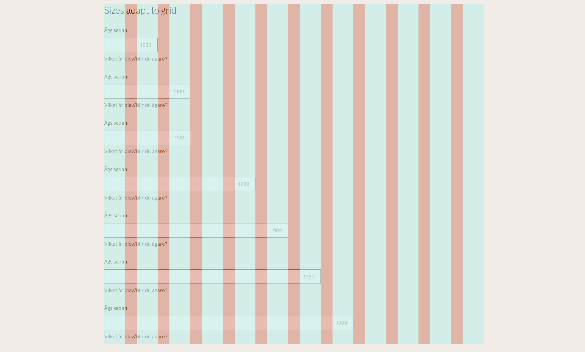
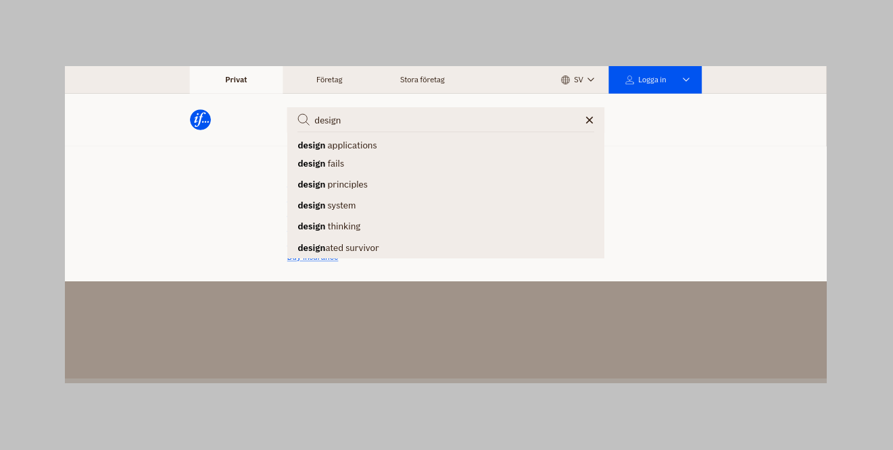

### Input fields

<figure class="if">

<figcaption class="if text caption">The anatomy of the input fields</figcaption>
</figure>

<div class="if alert-banner warning">

`@if-design-system/input-fields` has been added in a peer dependency for the affected packages. This is to alleviate the footprint, but also to make sure that the form components get the correct styling.

</div>

From the breaking change commit message:

    Due to accessibility and validation issues, we're changing the html
    syntax for the input-fields, in regards of labels and usage of the
    help-tooltip button. We've also added some new design styling to
    accommodate for v2 of the input fields. We've cleaned up some colors and
    borders as well. We've also added support for a clear field button. We
    separated out label, input-wrapper, reset, sizes and the help-tooltip
    feature in separate style files, for easier inclusion of just what you want.

<a href="/components/inputs/input-fields" class="if button secondary">Documentation</a>

#### Sizing

<figure class="if">

<figcaption class="if text caption">Our grid</figcaption>
</figure>

<div class="if text layout columns">
<div class="if text body">

Input field sizes now properly reflect our baseline grid.

</div>
</div>

#### Refactored marking of required fields

<div class="if text layout columns">
<div class="if text body">

Fields marked with the `required`-attribute now gets a required styling by default

</div>
</div>

<form autocomplete="off" action="">
  <div class="if input-wrapper">
    <input
      class="if input-field"
      required
      name="<identifier>"
      id="<identifier>"
      type="number"
      data-size="small"
      placeholder="1989"
    />
    <label class="if" for="<identifier>">
      Ägs sedan
    </label>
  </div>
</form>

```html
<form autocomplete="off" action="">
  <div class="if input-wrapper">
    <input
      class="if input-field"
      required
      name="<identifier>"
      id="<identifier>"
      type="number"
      data-size="small"
      placeholder="1989"
    />
    <label class="if" for="<identifier>"> Ägs sedan </label>
  </div>
</form>
```

#### Programmatically state optional fields <span class="if tag small status success">new</span>

<div class="if text layout columns">
<div class="if text body">

We have added the `is-optional` flag to mark a field as optional. This is a translated property, depending on the `<html lang="">`- attribute. See translations further down.

</div>
</div>

<form autocomplete="off" action="">
  <div class="if input-wrapper">
    <input
      class="if input-field is-optional"
      name="<identifier>"
      id="<identifier>"
      type="number"
      data-size="small"
      placeholder="1989"
    />
    <label class="if" for="<identifier>">
      Ägs sedan
    </label>
    <span class="if input-help">
      Vilket år blev/blir du ägare?
    </span>
  </div>
</form>

```html
<form autocomplete="off" action="">
  <div class="if input-wrapper">
    <input
      class="if input-field is-optional"
      name="<identifier>"
      id="<identifier>"
      type="number"
      data-size="small"
      placeholder="1989"
    />
    <label class="if" for="<identifier>"> Ägs sedan </label>
    <span class="if input-help"> Vilket år blev/blir du ägare? </span>
  </div>
</form>
```

##### Translations

| Language         | Translation    |
| ---------------- | -------------- |
| English(default) | optional       |
| Norwegian        | valgfritt      |
| Swedish          | valfri         |
| Danish           | valgfri        |
| Finnish          | valinnainen    |
| Estonian         | valikuline     |
| Latvian          | neobligāti     |
| Lithuanian       | neprivaloma    |
| Russian          | необязательный |

#### Reset/Clear field button <span class="if tag small status success">new</span>

We have added support for a clear input field.

<div class="if alert-banner info">
  <p class="if">
    The usage of the reset button is optional. Choose the best use case for this.
  </p>
</div>

<form autocomplete="off" action="">
  <div class="if input-wrapper">
    <input
      class="if input-field"
      value="2011"
      name="<identifier>"
      id="<identifier>"
      type="number"
      data-size="small"
      placeholder="1989"
    />
    <button type="button" class="if reset" style="left: 1rem; top: calc(100% - 8px - 24px);" aria-label="Reset"></button>
    <label class="if" for="<identifier>">
      Ägs sedan
    </label>
  </div>
</form>

```html
<form autocomplete="off" action="">
  <div class="if input-wrapper">
    <input
      class="if input-field"
      value="2011"
      name="<identifier>"
      id="<identifier>"
      type="number"
      data-size="small"
      placeholder="1989"
    />
    <button type="button" class="if reset" aria-label="Reset"></button>
    <label class="if" for="<identifier>"> Ägs sedan </label>
  </div>
</form>
```

<div class="if text layout columns">
  <div class="if text body">
    <p class="if">
      Due to the constraints of the markup, and that we are reliable of the state of the input field to
      display certain control and label features, you will need some javascript to achieve the correct
      positioning of the reset button.
    </p>
  </div>
</div>

```javascript
const calculateCorrectPositionForResetButton = input => {
  const reset = input.parentElement.querySelector('.if.reset');
  if (!reset) return;

  const parentRect = input.parentElement.getBoundingClientRect();
  const inputRect = input.getBoundingClientRect();
  const resetRect = reset.getBoundingClientRect();

  reset.style.top = `${inputRect.top - parentRect.top + inputRect.height / 2 - resetRect.height / 2}px`;
  if (input.getAttribute('type') == 'number') {
    reset.style.left = '1rem';
  } else {
    reset.style.left = `${inputRect.width - 18}px`;
  }
};
const inputs = document.querySelectorAll('input.if');
inputs.forEach(input => {
  window.requestAnimationFrame(function () {
    calculateCorrectPositionForResetButton(input);
  });
});
```

#### Design changes

We have moved the tooltip button closer to the label.

<div class="if types">
<figure class="if type">
<div class="if example">
<div class="if input-wrapper">
  <input
    class="if input-field"
    name="input-field-states-yeahyeahyeah2222sss"
    id="input-field-states-yeahyeahyeah2222sss"
    type="number"
    data-size="small"
    placeholder="1989"
  />
  <div class="if input-label-wrapper">
    <label class="if" for="input-field-states-yeahyeahyeah2222sss" style="display: flex; align-items: flex-end; width: 100%;">Ägs sedan<button style="margin-left: auto;" type="button" class="if help-tooltip" aria-label="Help"></button></label
    >
  </div>
  <span class="if input-help"> Vilket år blev/blir du ägare? </span>
</div>
</div>
<figcaption class="if description">
<span class="if title">Before</span>
</figcaption>
</figure>
<figure class="if type">
<div class="if example">
<div class="if input-wrapper">
  <input
    class="if input-field"
    name="input-field-states-yeahyeahyeah2222ssssad"
    id="input-field-states-yeahyeahyeah2222ssssad"
    type="number"
    data-size="small"
    placeholder="1989"
  />
  <div class="if input-label-wrapper">
    <label class="if" for="input-field-states-yeahyeahyeah2222ssssad">Ägs sedan</label
    ><span class="if inline-nowrap"><button type="button" class="if help-tooltip" aria-label="Help"></button></span>
  </div>
  <span class="if input-help"> Vilket år blev/blir du ägare? </span>
</div>
</div>
<figcaption class="if description">
<span class="if title">After</span>
</figcaption>
</figure>
</div>

#### Renaming wrapper

<div class="if text layout columns">
<div class="if text body">

We have renamed the `form-group` wrapper, to `input-wrapper`. This is a search and replace change. The term `form-group` was not a logical name, so we renamed it.

From:

```html
<div class="if form-group">…</div>
```

To:

```html
<div class="if input-wrapper">…</div>
```

</div>
<div class="if text body">

<div class="if text layout box right dark">

The changes also affect these components:

- [Autocomplete](/components/inputs/autocomplete)
- [Datepicker](/components/inputs/datepicker)
- [Dropdown](/components/dropdown)
- [File upload](/components/inputs/file-upload)
- [Search field](/components/inputs/search-field) <span class="if tag status success small">new</span>
- [Selection controls](/components/selection-controls)

Basically everywhere you used a `form-group`

</div>
</div>
</div>

#### Markup changes

<div class="if text layout columns">
<div class="if text body">

We've changed the markup for input fields, to have more valid html.

<a href="https://dev.azure.com/if-it/If%20Design%20Hub/_boards/board/t/If%20Design%20Hub%20Team/Stories/?workitem=308914" class="if button secondary" target="_blank" rel="noreferrer noopener">Related workitem<span className="if axe sr-only">, Opens in new window</span></a>

</div>
<div class="if text body">

<div class="if text layout box right dark">

The changes also affect these components:

- [Autocomplete](/components/inputs/autocomplete)
- [Datepicker](/components/inputs/datepicker)
- [Dropdown](/components/dropdown)
- [File upload](/components/inputs/file-upload)
- [Search field](/components/inputs/search-field) <span class="if tag status success small">new</span>
- [Selection controls](/components/selection-controls)

Basically everywhere you use a `<label>`

</div>
</div>
</div>

This is the old syntax:

```html
<div class="if form-group">
  <input type="text" id="full_name" name="full_name" placeholder="Enter your full name" class="if input-field" />
  <label class="if help" for="full_name">
    Full name
    <button type="button" class="if help-tooltip" aria-label="Lorum ipsum dolor sit amet"></button>
  </label>
  <span class="if input-help">We need your full name..</span>
</div>
```

And this is the new syntax:

```html
<div class="if input-wrapper">
  <input
    class="if input-field"
    name="input-field-states-yeahyeahyeah"
    id="input-field-states-yeahyeahyeah"
    type="number"
    data-size="small"
    placeholder="1989"
  />
  <div class="if input-label-wrapper">
    <label class="if" for="input-field-states-yeahyeahyeah">Ägs sedan</label
    ><span class="if inline-nowrap"><button type="button" class="if help-tooltip" aria-label="Help"></button></span>
  </div>
  <span class="if input-help"> Vilket år blev/blir du ägare? </span>
</div>
```

<div class="if alert-banner warning">
  <p class="if">
    <strong class="if">NOTE!</strong> To make sure that the help-tooltip does not wrap on a new line by
    itself, use the <code class="if">span class="if inline-nowrap"</code>-element to wrap the
    help-tooltip.
  </p>
  <p class="if">
    Make sure that it is placed RIGHT after the labelwrapper, with no whitespace!
  </p>
</div>

### Global header

<figure class="if">

<figcaption class="if text caption">Co branded logo</figcaption>
</figure>

From the breaking change commit message:

    Make co-branded logo and logo separate elementsMake co-branded logo and
    logo separate elements so they can link to different URLs. Also document
    support for removal of If logo.

<a href="/components/page-sections/global-header" class="if button secondary">Documentation</a>

#### Separated the co-branded logo from the if logo

<div class="if text layout columns">
<div class="if text body">

We have now separated the logos into different links, so they can operate differently. The If logo now also support to be removed.

</div>
</div>

### Search field <span class="if tag status small success">new</span>

<figure class="if">

<figcaption class="if text caption">Search field</figcaption>
</figure>

From the breaking change commit message:

    Replaces the built in search component in the Global Header component,
    and other relevant usage areas like table filters etc

<a href="/components/inputs/search-field" class="if button secondary">Documentation</a>

<div class="if text layout columns">
<div class="if text body">

Refactored out the search field from the global header component and created a new component.

We also updated the design for the global header search field.

</div>
</div>

<form class="if" action="none" onsubmit="javascript: return false;" style="margin-bottom: 2rem;">
  <div class="if search-field" role="search">
    <input type="search" class="if input-field" id="ee1122rrff33s" name="ee1122rrff33s" aria-label="Search" placeholder="Search">
    <button type="button" class="if reset" aria-label="Reset"></button>
  </div>
</form>

```html
<form class="if" action="none" onsubmit="javascript: return false;">
  <div class="if search-field" role="search">
    <input
      type="search"
      class="if input-field"
      id="ee1122rrff33s"
      name="ee1122rrff33s"
      aria-label="Search"
      placeholder="Search"
    />
    <button type="button" class="if reset" aria-label="Reset"></button>
  </div>
</form>
```

### Dropdown

<div class="if text layout columns">
<div class="if text body">

We have refactored the markup of the dropdown to be more native. This to open up for a new type of dropdown (with menus and filters), but also to make implementation easier for developers.

</div>
</div>

Old syntax:

```html
<div class="if form-group">
  <div class="if dropdown">
    <select id="drop-down-implementation-1" class="if" required>
      <option value="" disabled selected hidden>Välj våningar</option>
      <option value="1">1 våning</option>
      <option value="2">2 våningar</option>
      <option value="3">3 våningar</option>
    </select>
  </div>
  <label for="drop-down-implementation-1" class="if">Välj antal våningar</label>
</div>
```

New syntax:

```html
<div class="if input-wrapper">
  <select class="if dropdown" id="ad" name="ad">
    <option value="" disabled hidden>Välj våningar</option>
    <option value="1" selected>1 våning</option>
    <option value="2">2 våningar</option>
    <option value="3">3 våningar</option>
  </select>
  <label class="if" for="ad">Välj antal våningar</label>
</div>
```

### New forms section

<div class="if text layout columns">
<div class="if text body">

We have started to document forms in a separate section. The documentation is not full fletched, but it contains the basics. This will expand when we have landed on the form layouts.

<a href="/design/guidelines/forms" class="if button secondary">Documentation</a>

</div>
</div>
