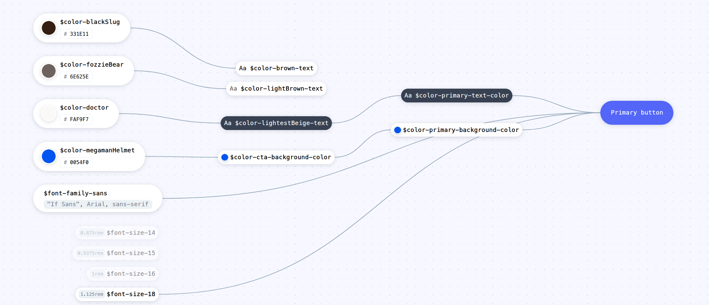

This release is mainly a refactoring release, with few additions.

### Components

<div class="if text layout columns">
<div class="if text body">

We have renamed and extracted several components. The reasoning behind this is to make them easier to find, have a component name closer to what it does and what it does not and to leverage the footprint of the components when installed.

We have compared all of our components to other high end design systems and used them to align naming. Systems like [Adobe Spectrum](https://spectrum.adobe.com/), [Carbon Design System](https://www.carbondesignsystem.com/), [Lightning Design System](https://www.lightningdesignsystem.com/) and [Google Material](https://material.io/).

<a href="https://dev.azure.com/if-it/If%20Design%20Hub/_boards/board/t/If%20Design%20Hub%20Team/Stories/?workitem=336508" class="if button secondary" target="_blank" rel="noreferrer noopener">Related workitem<span className="if axe sr-only">, Opens in new window</span></a>

</div>
</div>

#### Button <span class="if tag small status warning" style="top: 50%; transform: translateY(-50%);position: absolute;">altered</span>

Renamed Tertiary Button to Text Button.

<a href="/components/actions/button#components-button-text-button" class="if button secondary">Documentation</a>

Extracted the Button Icon into new component, Icon Button.

<a href="/components/actions/icon-button" class="if button secondary">Documentation</a>

#### Icon button <span class="if tag small status success" style="top: 50%; transform: translateY(-50%);position: absolute;">new</span>

Component extracted from the Button Component.

<a href="/components/actions/icon-button" class="if button secondary">Documentation</a>

#### Card <span class="if tag small status error" style="top: 50%; transform: translateY(-50%);position: absolute;">removed</span>

<div class="if text layout columns">
  <div class="if text body">

Removed the Card component, since Card is a pattern. Extracted Editorial Card as a separate component.

<a href="/components/cards/editorial-card" class="if button secondary">Documentation</a>

</div>

<figure class="if">

<figcaption class="if text caption">Editorial Card Component</figcaption>
</figure>

</div>

#### Crosslinks <span class="if tag small status error" style="top: 50%; transform: translateY(-50%);position: absolute;">removed</span>

<div class="if text layout columns">
  <div class="if text body">

All of the Crosslink variations has been either removed or renamed.

- Studio Crosslink has been extracted and renamed to [Navigational Card, studio variant](/components/cards/navigational-card).
- Lifestyle Crosslink has been removed.
- Expandable Studio Crosslink has been extracted and renamed to [Disclosure Card](/components/cards/disclosure-card).
- Button Crosslink has been renamed and extracted to [Shortcuts](/components/navigation/shortcuts).
- Crosslink List has been renamed and extracted to [Link List](/components/navigation/link-list).

</div>
</div>

<div class="if alert-banner warning">

To accomodate for this change, which is not just a "search and replace"-change, please follow [the migration guide](/blog/v12-migration-guide).

</div>

From the breaking change commit message:

    Crosslinks have seized to exist. They are all extracted into separate
    components.

#### Navigational Card <span class="if tag small status success" style="top: 50%; transform: translateY(-50%);position: absolute;">new</span>

Component extracted from the Crosslinks Component. Previously known as Studio Crosslink.

<a href="/components/cards/navigational-card" class="if button secondary">Documentation</a>

#### Disclosure Card <span class="if tag small status success" style="top: 50%; transform: translateY(-50%);position: absolute;">new</span>

Component extracted from the Crosslinks Component. Previously known as Expandable Studio Crosslink.

<a href="/components/cards/disclosure-card" class="if button secondary">Documentation</a>

#### Shortcuts <span class="if tag small status success" style="top: 50%; transform: translateY(-50%);position: absolute;">new</span>

Component extracted from the Crosslinks Component. Previously known as Button Crosslink.

<a href="/components/navigation/shortcuts" class="if button secondary">Documentation</a>

#### Link List <span class="if tag small status success" style="top: 50%; transform: translateY(-50%);position: absolute;">new</span>

Component extracted from the Crosslinks Component. Previously known as Crosslink List.

<a href="/components/navigation/link-list" class="if button secondary">Documentation</a>

#### Cube <span class="if tag small status error" style="top: 50%; transform: translateY(-50%);position: absolute;">removed</span>

<div class="if text layout columns">
  <div class="if text body">

The Cube Component is removed. It is basically a styled table.

</div>

<figure class="if">

<figcaption class="if text caption">Cube Component</figcaption>
</figure>

</div>

From the breaking change commit message:

    The cube component is now removed from the DS, it is just a styled
    table. If you need guidance or help with the styling, contact us 😊

<div class="if alert-banner warning">

To accomodate for this change, which is not just a "search and replace"-change, please follow [the migration guide](/blog/v12-migration-guide).

</div>

#### Dropdown <span class="if tag small status warning" style="top: 50%; transform: translateY(-50%);position: absolute;">renamed</span>

<div class="if text layout columns">
  <div class="if text body">

Dropdown has been renamed to Dropdown Select

<a href="/components/inputs/dropdown-select" class="if button secondary">Documentation</a>

</div>

<figure class="if">

<figcaption class="if text caption">Dropdown Select Component</figcaption>
</figure>

</div>

#### Expandable <span class="if tag small status warning" style="top: 50%; transform: translateY(-50%);position: absolute;">renamed</span>

Expandable has been renamed to Panel, since expandable is a pattern.

<a href="/components/page-sections/panel" class="if button secondary">Documentation</a>

#### Hero <span class="if tag small status warning" style="top: 50%; transform: translateY(-50%);position: absolute;">altered</span>

- [Hero Navigation](/components/page-sections/hero-navigation) has been extracted to a separate component.
- Hero without image has been extracted and renamed to [Header](/components/page-sections/header).

#### Hero Navigation <span class="if tag small status success" style="top: 50%; transform: translateY(-50%);position: absolute;">new</span>

Component extracted from the Hero Component.

<a href="/components/page-sections/hero-navigation" class="if button secondary">Documentation</a>

#### Header <span class="if tag small status success" style="top: 50%; transform: translateY(-50%);position: absolute;">new</span>

Component extracted from the Hero Component.

<a href="/components/page-sections/header" class="if button secondary">Documentation</a>

#### Input fields <span class="if tag small status warning" style="top: 50%; transform: translateY(-50%);position: absolute;">altered</span>

<div class="if text layout columns">
<div class="if text body">

- Label has been renamed and extracted to [Input Label](/components/inputs/input-label).
- [Textarea](/components/inputs/textarea) has been extracted as a separate component.
- [Numeric Stepper](/components/inputs/numeric-stepper) has been extracted as separate component.

</div>
<div class="if text layout box right dark">

The Input Fields component has been added as a dependency to these components

- [Autocomplete](/components/inputs/autocomplete)
- [Datepicker](/components/inputs/datepicker)
- [Dropdown Select](/components/inputs/dropdown-select)
- [File upload](/components/inputs/file-upload)
- [Numeric Stepper](/components/inputs/numeric-stepper)
- [Search Field](/components/inputs/search-field)

</div>
</div>

#### Input Label <span class="if tag small status success" style="top: 50%; transform: translateY(-50%);position: absolute;">new</span>

<div class="if text layout columns">
<div class="if text body">

Component extracted from the Input Fields Component.

<a href="/components/inputs/input-label" class="if button secondary">Documentation</a>

</div>

<div class="if text layout box right dark">

The Input Label component has been added as a dependency to these components

- [Autocomplete](/components/inputs/autocomplete)
- [Datepicker](/components/inputs/datepicker)
- [Dropdown Select](/components/inputs/dropdown-select)
- [File upload](/components/inputs/file-upload)
- [Numeric Stepper](/components/inputs/numeric-stepper)
- [Search Field](/components/inputs/search-field)
- [Input Fields](/components/inputs/input-fields)

</div>
</div>

#### Textarea <span class="if tag small status success" style="top: 50%; transform: translateY(-50%);position: absolute;">new</span>

Component extracted from the Input Fields Component.

<a href="/components/inputs/textarea" class="if button secondary">Documentation</a>

#### Numeric Stepper <span class="if tag small status success" style="top: 50%; transform: translateY(-50%);position: absolute;">new</span>

Component extracted from the Input Fields Component.

<a href="/components/inputs/numeric-stepper" class="if button secondary">Documentation</a>

#### Menu <span class="if tag small status error" style="top: 50%; transform: translateY(-50%);position: absolute;">removed</span>

The Menu Component has been removed. All of the Menu Component variants has been extracted and/or renamed:

- Application Menu is renamed and extracted to [Dropdown Menu](/components/navigation/dropdown-menu).
- List Menu is renamed and extracted to [Sidebar Menu](/components/navigation/sidebar-menu).
- [Accordion Menu](/components/navigation/accordion-menu) is extracted as a separate component.
- Context Menu is renamed and extracted to [Tooltip Menu](/components/navigation/tooltip-menu).
- Overflow Menu is renamed and extracted to [Contextual Menu](/components/actions/contextual-menu).

<div class="if alert-banner warning">

To accomodate for this change, which is not just a "search and replace"-change, please follow [the migration guide](/blog/v12-migration-guide).

</div>

#### Dropdown Menu <span class="if tag small status success" style="top: 50%; transform: translateY(-50%);position: absolute;">new</span>

Component extracted from the Menu Component.

<a href="/components/navigation/dropdown-menu" class="if button secondary">Documentation</a>

#### Sidebar Menu <span class="if tag small status success" style="top: 50%; transform: translateY(-50%);position: absolute;">new</span>

Component extracted from the Menu Component.

<a href="/components/navigation/sidebar-menu" class="if button secondary">Documentation</a>

#### Accordion Menu <span class="if tag small status warning" style="top: 50%; transform: translateY(-50%);position: absolute;">extracted</span>

Component extracted from the Menu Component.

<a href="/components/navigation/accordion-menu" class="if button secondary">Documentation</a>

#### Tooltip Menu <span class="if tag small status success" style="top: 50%; transform: translateY(-50%);position: absolute;">new</span>

Component extracted from the Menu Component.

<a href="/components/navigation/tooltip-menu" class="if button secondary">Documentation</a>

#### Contextual Menu <span class="if tag small status success" style="top: 50%; transform: translateY(-50%);position: absolute;">new</span>

Component extracted from the Menu Component.

<a href="/components/actions/contextual-menu" class="if button secondary">Documentation</a>

### Minimal Header <span class="if tag small status warning" style="top: 50%; transform: translateY(-50%);position: absolute;">renamed</span>

Minimal Header is renamed to Global Minimal Header. (_Global Footer, Global Header, Global Minimal Header._)

<a href="/components/page-sections/global-minimal-header" class="if button secondary">Documentation</a>

### Notification <span class="if tag small status warning" style="top: 50%; transform: translateY(-50%);position: absolute;">renamed</span>

Notification has been renamed to Alert Banner.

<a href="/components/feedback/alert-banner" class="if button secondary">Documentation</a>

### Popover <span class="if tag small status warning" style="top: 50%; transform: translateY(-50%);position: absolute;">altered</span>

The Tooltip component has been extracted into a separate component.

<a href="/components/overlay/tooltip" class="if button secondary">Documentation</a>

#### Tooltip <span class="if tag small status success" style="top: 50%; transform: translateY(-50%);position: absolute;">new</span>

Component extracted from the Button Component.

<a href="/components/overlay/tooltip" class="if button secondary">Documentation</a>

### Selection Controls <span class="if tag small status error" style="top: 50%; transform: translateY(-50%);position: absolute;">removed</span>

The Selection Controls Component has been removed. All of the variants has been extracted:

- [Radio button](/components/radio-button) is extracted into a separate component.
- [Checkbox](/components/inputs/checkbox) is extracted into a separate component.
- [Toggle](/components/inputs/toggle) is extracted into a separate component.

From the breaking change commit message:

    Selection controls is no more. Has ceased to be. Bereft of life, it
    rests in peace. This is an ex-component. The component is split into
    Radio Buttons, Toggle Control and Checkbox

#### Radio Button <span class="if tag small status success" style="top: 50%; transform: translateY(-50%);position: absolute;">new</span>

Component extracted from the Selection Controls Component.

<a href="/components/radio-button" class="if button secondary">Documentation</a>

#### Checkbox <span class="if tag small status success" style="top: 50%; transform: translateY(-50%);position: absolute;">new</span>

Component extracted from the Selection Controls Component.

<a href="/components/inputs/checkbox" class="if button secondary">Documentation</a>

#### Toggle <span class="if tag small status success" style="top: 50%; transform: translateY(-50%);position: absolute;">new</span>

Component extracted from the Selection Controls Component.

<a href="/components/inputs/toggle" class="if button secondary">Documentation</a>

### Teasers <span class="if tag small status error" style="top: 50%; transform: translateY(-50%);position: absolute;">removed</span>

The Teaser Component is removed, and the variants has been either removed or extracted and renamed:

- Studio teaser has been removed in favour of the Studio variant of Navigational Card.
- Lifestyle teaser has been extracted as a Lifestyle variant of Navigational Card.
- Text teaser has been extracted as a Text variant of Navigational Card.

<a href="/components/cards/navigational-card" class="if button secondary">Documentation</a>

From the breaking changes commit message:

    Teasers are no more. It has been replaced with Lifestyle Navigational
    Card, Text Navigational Card. Studio Teasers is gone, use Studio
    Navigational Card instead, which is based on the old Studio Crosslinks

<div class="if alert-banner warning">

To accomodate for this change, which is not just a "search and replace"-change, please follow [the migration guide](/blog/v12-migration-guide).

</div>

### Usp <span class="if tag small status warning" style="top: 50%; transform: translateY(-50%);position: absolute;">renamed</span>

The USP Component is now renamed as Quick Facts.

<a href="/components/page-sections/quick-facts" class="if button secondary">Documentation</a>

### Blockquote <span class="if tag small status success" style="top: 50%; transform: translateY(-50%);position: absolute;">new</span>

Blockquote has been extracted from Core as a separate component.

<a href="/components/text/blockquote" class="if button secondary">Documentation</a>

### Dropdown filter <span class="if tag small status success" style="top: 50%; transform: translateY(-50%);position: absolute;">new</span>

The table filters from Data Table has been extracted and renamed to Dropdown Filter.

<a href="/components/inputs/dropdown-filter" class="if button secondary">Documentation</a>

### Footer <span class="if tag small status warning" style="top: 50%; transform: translateY(-50%);position: absolute;">renamed</span>

The Footer Component has been renamed to Global Footer. (_Global Footer, Global Header, Global Minimal Header._)

<a href="/components/page-sections/global-footer" class="if button secondary">Documentation</a>

### Design Tokens

<div class="if text layout columns">
  <div class="if text body">

We have revamped the Design Tokens we have, renamed and added new ones.

The former system used to create and manage Design Tokens was [Theo](https://github.com/salesforce-ux/theo), a system created by Salesforce. It worked for us in the beginning, but we needed some more control over the connections between the tokens.

We are now using [Style Dictionary](https://github.com/amzn/style-dictionary), from Amazon.

With the switch, it is now easier to maintain the Design Tokens and to cater to more frameworks, native and web.

<a href="https://dev.azure.com/if-it/If%20Design%20Hub/_boards/board/t/If%20Design%20Hub%20Team/Stories/?workitem=371377" class="if button secondary" target="_blank" rel="noreferrer noopener">Related workitem<span className="if axe sr-only">, Opens in new window</span></a>

  </div>
</div>

<div class="if text layout columns">
  <div class="if text body">

The Design Tokens are now named with this structure: CTISiS: `Category, Type, Item, Sub item, State`, like:

</div>
</div>

```stylus
// category: color
// type: base
// item: light-blue
// sub item: 100
$color-base-light-blue-100
```

or

```stylus
// category: size
// type: spacing
// item: 16
$size-spacing-16
```

<div class="if text layout columns">
<div class="if text body">

The full documentation about the base of our Design Tokens are yet to be created, but we have [reserved space for it](/design-tokens).

We are also looking into how to document and visualize the connections between design tokens.

</div>

</div>

<figure class="if">

<figcaption class="if text caption">An example on how we can visualize the Design Token relations</figcaption>
</figure>

### Mixins

<div class="if text layout columns">
<div class="if text body">

All of our mixins, both internal and external has now been renamed. All of the preprocessor mixins have the same naming, making it easier to identify.

The new structure is:

```stylus
.a-selector
  IDS_TYPOGRAPHY_FontFamily_Sans()
  IDS_ICONS_Icon_Ui_Data_upload()
  +IDS_BREAKPOINT_MQ_ExtraSmall_Min()
    padding-left $size-spacing-32
    padding-right $size-spacing-88
  +IDS_BREAKPOINT_MQ_Smaller_Min()
    padding-left $size-spacing-40
    padding-right $size-spacing-96
  +IDS_BREAKPOINT_MQ_Medium_Min()
    line-height $size-line-height-32
```

```scss
.a-selector {
  @include IDS_TYPOGRAPHY_FontFamily_Sans;
  @include IDS_ICONS_Icon_Ui_Data_upload;
  @include IDS_BREAKPOINT_MQ_ExtraSmall_Min {
    padding-left: $size-spacing-32;
    padding-right: $size-spacing-88;
  }
  @include IDS_BREAKPOINT_MQ_Smaller_Min {
    padding-left: $size-spacing-40;
    padding-right: $size-spacing-96;
  }
  @include IDS_BREAKPOINT_MQ_Medium_Min {
    line-height: $size-line-height-32;
  }
}
```

```less
.a-selector {
  .IDS_TYPOGRAPHY_FontFamily_Sans();
  .IDS_ICONS_Icon_Ui_Data_upload();
  .IDS_BREAKPOINT_MQ_ExtraSmall_Min({
    padding-left: @size-spacing-32;
    padding-right: @size-spacing-88;
  )};
  .IDS_BREAKPOINT_MQ_Smaller_Min({
    padding-left: @size-spacing-40;
    padding-right: @size-spacing-96;
  )};
  .IDS_BREAKPOINT_MQ_Medium_Min({
    line-height: @size-line-height-32;
  )};
}
```

All of the mixins are now prefixed with `IDS_` (If Design System) and is followed by a capitalized component name `TYPOGRAPHY_` to indicate where the mixin is created, and followed with a clear name of what the mixin does.

<a href="https://dev.azure.com/if-it/If%20Design%20Hub/_boards/board/t/If%20Design%20Hub%20Team/Stories/?workitem=268081" class="if button secondary" target="_blank" rel="noreferrer noopener">Related workitem<span className="if axe sr-only">, Opens in new window</span></a>

</div>
</div>

### Documentation Structure

We've done some changes in the information structure on the documentation site:

- Page templates has been moved under resources
- Changelog and News (release notes etc) is always in the left sidebar menu
- Patterns is now a separate top level menu item
- Develop is now moved under If Design System -> Develop
- If Design System is a new top level item
- Introduction and Getting Started is moved under If Design System
- Foundation is a new top level item replacing Design
- Design Token is a new top level item for documentation of usage and all of our design tokens.
