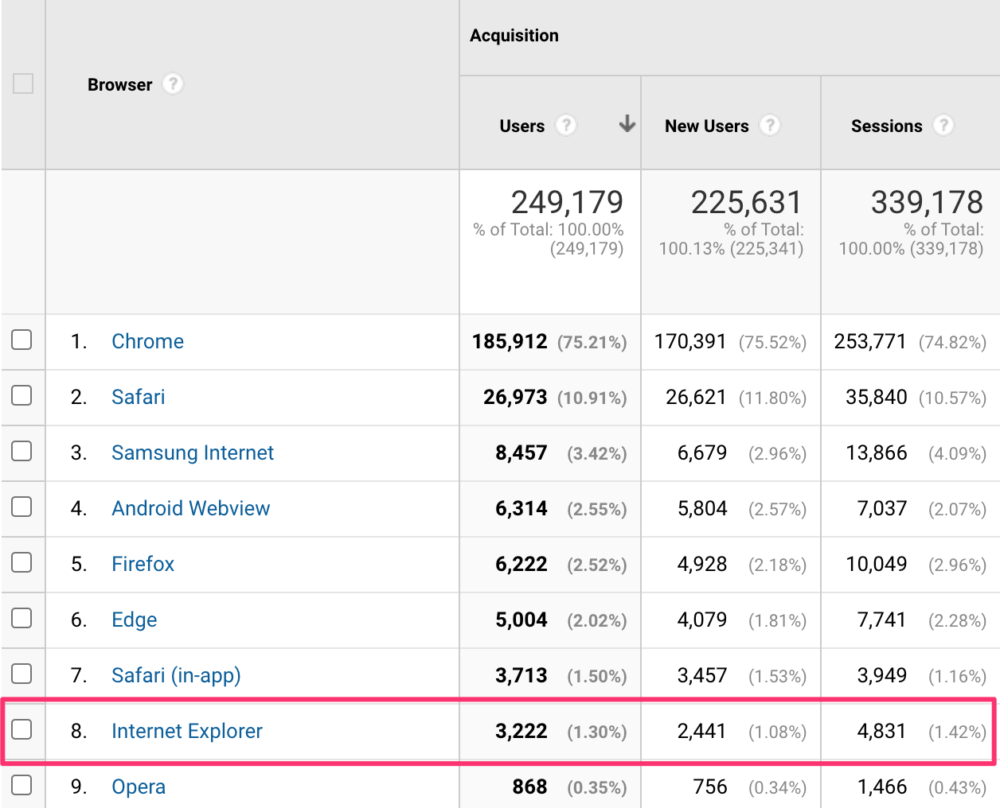
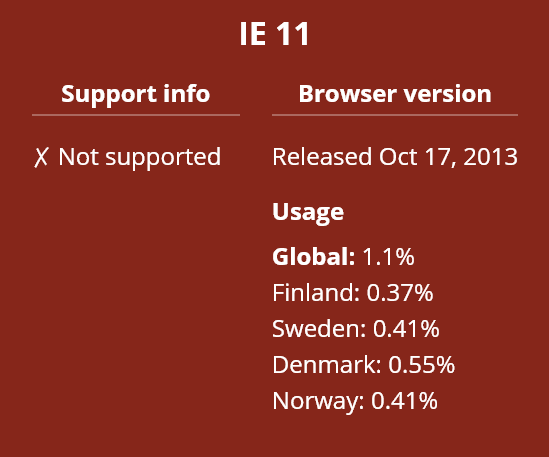
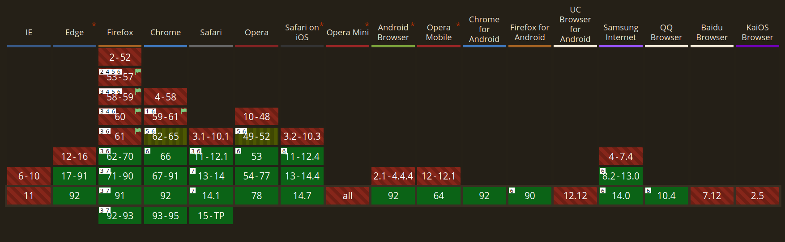

<div class="if text layout columns">
<div class="if text">

If is no longer supporting (in general) IE11, and several teams at If has stopped supporting IE11, so now it is our turn. We have removed support for IE11. No updates other than a reinstall is required.

</div>
</div>

<div class="if alert-banner info">
  <span class="if heading smallest">
    IE11 support for legacy services
  </span>
  <p class="if">
  If your app or team require IE11 support for some services, you have to add/develop and maintain them from within the team.
  </p>

</div>

<div class="if block">
<blockquote class="if">
  <p class="if">
    “On August 17, 2020, Microsoft published a timeline indicating that Microsoft Teams will stop supporting Internet Explorer 11 on November 30, 2020 whereas Microsoft 365 products will end Internet Explorer 11 support on August 17, 2021.”
  </p>
</blockquote>
</div>

<div class="if text layout columns">
<div class="if text">

Over time, we have seen a decrease in IE11 usage of our sites, and when the usage matched our criteria for removing support for IE11 in the design system, we followed trough.

Maintaining IE11 support is a costly endeavour, in terms of pure dev maintenance, but also in terms of footprint of the If Design System.

</div>
<div>

<figure class="if">

<figcaption class="if text caption">IE11 statistics for if.ee</figcaption>
</figure>

<figure class="if">

<figcaption class="if text caption">Nordic IE11 usage from Statscounter</figcaption>
</figure>

</div>
</div>

### What we have actually done

<div class="if text layout columns">
<div class="if text">

Up until now, we have used variable fonts for modern browsers, and a progressive fallback for IE11. We have removed the fallback, and shaved ~100kb of our bundle. Variable fonts are now supported in all modern browsers

</div>

</div>

<figure class="if">

<figcaption class="if text caption">Variable fonts usage from caniuse.com</figcaption>
</figure>

To be more specific, we have changed this:

```scss
@mixin IDS_TYPOGRAPHY_Heading_Largest() {
  …
  font-family: $font-family-sans-thin;
  font-weight: 100;
  @suports(display:grid){
    font-variation-settings: 'wght' $font-weight-40;
    font-weight: normal;
  }
  …
}
```

To this, where applicable:

```scss
@mixin IDS_TYPOGRAPHY_Heading_Largest() {
  …
  font-family: $font-family-sans-thin;
  font-variation-settings: 'wght' $font-weight-40;
  font-weight: normal;
  …
}
```

### Further reading

- [The End of Life of Internet Explorer 11](https://codeandchaos.medium.com/the-end-of-life-of-internet-explorer-11-12736f9ff75f)
- [Microsoft 365 apps say farewell to Internet Explorer 11 and Windows 10 sunsets Microsoft Edge Legacy](https://techcommunity.microsoft.com/t5/microsoft-365-blog/microsoft-365-apps-say-farewell-to-internet-explorer-11-and/ba-p/1591666)
